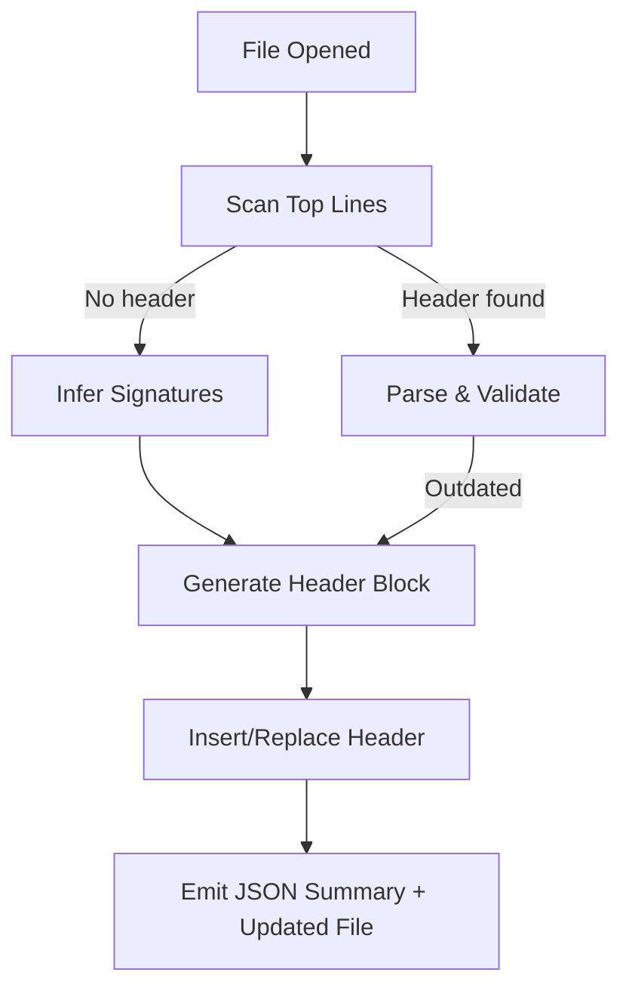
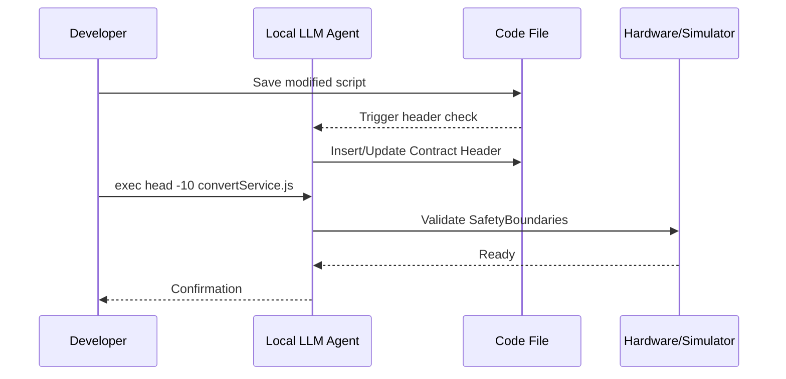

# Contract‑Header Automation Specification v1.0

**A compact interface standard for LLM‑aware code and localized AI systems**
**Draft — February 2026**

**Written By: Aphix**
*2026-02-04*

> *Disclaimer:* There are occasional portions discussing a concept of "safety." "Safety" is often a euphemism for built-in desire for regulation, because regulation requires compliance and only the largest corporations have the resources to comply, so they love it and push for it. This specification is designed simply to save everyone time and resources, and maybe it'll encourage better variable naming as a side-effect. YAML is discouraged.

***

## 1. Motivation

Every byte shoveled into an LLM’s maw costs tokens, and thus time, power, and, if you’re unlucky, actual money.  When local models are small but fast—like those running under Devstral or OpenClaw—a single misplaced comment can push a prompt over its efficiency edge.

So the emerging consensus: don’t make models read what can be summarized.

A compact **header block** at the top of a file which defines **inputs**, **outputs**, and the **intent** of the code beneath forms an elegant contract.  Humans skim it for documentation, machines treat it as an executable schema.  The rest of the file can sleep undisturbed until someone needs it.

This specification defines that header, its update automation, and expected model behavior when such headers appear.

***

## 2. Scope

Applies to:

- Any single‑file code artifact (e.g., `.js`, `.mjs`, `.ts`, `.cjs`, `.py`, or pseudocode)
- Any local or cloud AI assistant performing static analysis, editing, or autonomous refactoring
- Any hybrid environment (LLM + hardware proxy) executing bounded tasks, from API wrapping to printing titanium widgets

Exclusions:

- Multi‑module dependency mapping (a v1.1 concern)
- Secret inference beyond header declarations

***

## 3. High‑Level Concept

At file load or save, a local agent parses top‑level signatures, I/O patterns, and metadata tokens.
It then updates or generates a **header block**, formatted as comments native to the language.

Example (JavaScript style):

```js
/*
Contract-Header v1.0
File: captureThingAndConvertService.js
Description: Captures sensor data and converts normalized values for local persistence.
Inputs: stream(sensorPacket), configFile(path)
Outputs: normalizedData(array), report(json)
LastGenerated: 2026-02-04T19:52:00Z
*/
```

The file’s body follows. Tools that need quick semantic access can run:

```
exec head -10 captureThingAndConvertService.js
```

and interpret the snippet as a compact contract.

***

## 4. Header Schema Definition

Each header must contain:


| Field | Type | Description |
| :-- | :-- | :-- |
| `Contract-Header` | string | Constant identifier and version |
| `File` | string | File name including extension |
| `Description` | string | Plainline summary (≤120 chars) |
| `Inputs` | list/string | Named or structured description of inflow variables |
| `Outputs` | list/string | Corresponding outflow descriptors |
| `Dependencies` | optional list | External modules, sensors, or APIs |
| `LastGenerated` | ISO‑8601 timestamp | A trace of automation |
| `Notes` | optional string | Human aside, short |


***

## 5. Automation Flow

### 5.1 Pseudocode overview

**Process:**

1. Detect language comment style (e.g., `//` for JS, `#` for Python, `/* */` for multiline).
2. Scan first 30 lines for existing `Contract-Header` marker.
3. Parse the source—or a stub execution trace—to infer function signatures, top‑level exports, and return types.
4. If header missing or outdated, generate new one.
5. Insert or replace at file head.
6. Return both modified file path and JSON summary for indexing.

### 5.2 Mermaid flow diagram




***

## 6. Implementation

### 6.1 Python Version

Below is a working Python implementation that detects and generates the header.

```python
import re, datetime, json, os

def generate_contract_header_py(filepath):
    with open(filepath, 'r', encoding='utf-8') as f:
        content = f.read()

    # --- Infer file basics ---
    filename = os.path.basename(filepath)
    # Naive extraction of function defs
    funcs = re.findall(r'def\s+(\w+)\s*\(([^)]*)\)', content)
    inputs = [f"{fn}({args})" for fn, args in funcs]
    # A trivial guess of outputs
    outputs = ["return_values"]

    header = f"""# Contract-Header v1.0
# File: {filename}
# Description: Auto-generated header
# Inputs: {', '.join(inputs) or 'None'}
# Outputs: {', '.join(outputs)}
# LastGenerated: {datetime.datetime.utcnow().isoformat()}Z
"""

    # Remove old header if present
    content_wo_header = re.sub(r"^# Contract-Header v1\.0.*?(?=\ndef|\nclass)", "", content, flags=re.S)

    new_content = header + "\n" + content_wo_header.strip() + "\n"
    with open(filepath, 'w', encoding='utf-8') as f:
        f.write(new_content)
    return header
```

**Example result:**

For a Python file:

```python
def capture_sensor(packet):
    return normalize(packet)
```

Running:

```python
generate_contract_header_py("capture_sensor.py")
```

Produces:

```python
# Contract-Header v1.0
# File: capture_sensor.py
# Description: Auto-generated header
# Inputs: capture_sensor(packet)
# Outputs: return_values
# LastGenerated: 2026-02-04T19:58:00Z

def capture_sensor(packet):
    return normalize(packet)
```


***

### 6.2 JavaScript Version

```javascript
import fs from "fs";

export function generateContractHeaderJs(filepath) {
  const content = fs.readFileSync(filepath, "utf8");
  const filename = filepath.split("/").pop();

  const funcMatches = [...content.matchAll(/function\s+(\w+)\s*\(([^)]*)\)/g)];
  const inputs = funcMatches.map(([_, name, args]) => `${name}(${args})`);
  const outputs = ["returnValues"];

  const header = `/*\nContract-Header v1.0\nFile: ${filename}\nDescription: Auto-generated header\nInputs: ${inputs.join(", ") || "None"}\nOutputs: ${outputs.join(", ")}\nLastGenerated: ${new Date().toISOString()}\n*/\n`;

  const cleaned = content.replace(/\/\*[\s\S]*?Contract-Header v1\.0[\s\S]*?\*\//, "");
  fs.writeFileSync(filepath, header + "\n" + cleaned.trim() + "\n");
  return header;
}
```

Example output placed atop:

```js
/*
Contract-Header v1.0
File: captureThingAndConvertService.js
Description: Auto-generated header
Inputs: captureData(stream), convertData(obj)
Outputs: returnValues
LastGenerated: 2026-02-04T19:58:00Z
*/
```


***

## 7. Execution Interface

A local LLM or tool may call an executor with a reduced context:

```
exec head -10 captureThingAndConvertService.js
```

The returned header can be parsed as a **semantic capsule**, serving as metadata when orchestrating multi‑file reasoning or hardware job queuing.

***

## 8. Edge Cases

### 8.1 Dynamic Inputs

Scripts that accept arbitrary kwargs or flexible schemas should embed a JSON sub‑field:

```js
Inputs: dynamicSchema: {"type": "object","patternProperties":{"^.*$": {"type":"any"}}}
```


### 8.2 Side Effects and Hardware Interaction

When headers describe physical operations (e.g., robotic arm control, 3D printing), they must include:

```
SafetyBoundaries: { voltageLimit: 24, area: "Hatch-A3" }
Mode: local-only
```

The automation layer must refuse execution when no `SafetyBoundaries` field exists but physical IO calls are detected.

### 8.3 Chained Outputs

For pipeline files, include array of downstream targets:

```
Outputs: normalizedData -> [aggregateStats.js, sendReport.js]
```


### 8.4 Comments Collision

If block comment syntax conflicts (e.g., nested `/* */`), tool falls back to single‑line markers.

### 8.5 Long Descriptions

If description exceeds 120 chars, split lines with `\` continuation; agents should concatenate automatically.

***

## 9. Versioning and Checksums

Each generated header may optionally include a SHA‑1 or SHA‑256 digest of the first 50 non‑comment lines:

```
Checksum: SHA256:deadbeef0123...
```

LLM agents can verify whether source mutations occurred versus header assumptions.

***

## 10. Model Behavior Specification

An LLM following this spec should:

- Trust headers describing inputs/outputs when visible within top 30 lines.
- Limit file parsing to remainder only upon mismatch or ambiguity.
- Update timestamps upon regeneration.
- Preserve manual `Notes:` and `SafetyBoundaries:` fields.

Example *header verification routine* (pseudo‑prompt):

> “If Contract‑Header v1.0 present and signatures consistent with body, summarize only header. Else regenerate header then summarize.”

***

## 11. Pragmatic Commentary (Mencken Moments)

At this point, one might ask why machines should write their own introductions. Because, like reporters at a dull council meeting, they would otherwise quote everything verbatim. A few lines of disciplined self‑awareness converts rambling code into accountable prose.

Still, the weakest link is human vanity: our tendency to ‘tweak’ the header until it flatters us. Resist. The header exists not to praise, but to warn.

And let it be said plainly: any developer who ships code without a proper contract header should be made to explain themselves before the nearest coffee pot.—**H.L.‑adjacent observation**

***

## 12. Integration with Local Pro‑sumer Hardware

Imagine a desktop printer that’s half CNC mill, half sculptor. Every print file can bear a header just like our scripts:

```c
; Contract-Header v1.0
; File: dragonKeycap.gcode
; Description: Prints a sculpted keycap in Renaissance style.
; Inputs: model.stl, filament(redPLA)
; Outputs: object/keycap
; SafetyBoundaries: {maxTemp:230, bedTemp:65}
; LastGenerated: 2026-02-04T20:00:00Z
```

The LLM managing job queues reads only this header to check if local conditions permit job launch.
The same token discipline that speeds code summarization now guards hardware behavior.

In effect, **the header becomes a safety interlock** — and one so simple that even a hobbyist system can honor it offline.

If that sounds almost poetic, good. Machines have begun to write their own disclaimers. We might as well insist they be literate.

***

## 13. Safety and Ethics Clause

- Automation must never dispatch real hardware commands without validated headers containing explicit safety fields.
- Any tool implementing this spec must default to dry‑run mode when `SafetyBoundaries` absent.
- Humans remain the final authority for execution beyond digital sandbox.

***

## 14. Compliance Matrix

| Requirement | Automated | Manual Allowed | Notes |
| :-- | :-- | :-- | :-- |
| Header detection | Yes | — | Regex or AST |
| Header regeneration | Yes | — | overwrite |
| Timestamp update | Yes | — | UTC only |
| Notes preservation | Yes | Yes |  |
| Safety verification | Yes | — | required for IO |
| Cross‑language comment style | Yes | — | mapping table |
| LLM header trust | Advisory | — |  |


***

## 15. Example: End‑to‑End Flow

**Scenario:** Developer modifies `convertService.js`.

1. Local watcher notes save event.
2. Python or JS generator updates header.
3. LLM reindexes header JSON summary.
4. User issues `exec head -10 convertService.js`.
5. Model reads, confirms contract, avoids parsing whole file.
6. Token cost drops ~90%.
7. Optional: downstream printer reads same header, declines unsafe jobs.

**Mermaid Sequence:**




***

## 16. Extensibility

Minor increments (v1.x) may add fields such as:

- `License:` for open‑source attribution
- `ContextWindow:` for token budgeting hints
- `Language:` explicit code language
- `SignatureHash:` verifying interface compatibility

***

## 17. Reference Implementation Concept (Mixed)

Developers can integrate generation step into build pipelines:

**npm script:**

```json
"scripts": {
  "precommit": "node tools/genContracts.js"
}
```

**Python pre‑commit hook:**

```yaml
- repo: local
  hooks:
    - id: contract-header
      name: update contract header
      entry: python tools/gen_contract_headers.py
      language: python
```

This ensures headers stay synced without manual invocation.

***

## 18. Performance Considerations

Average header length: 6–10 lines.
Average token cost saved: 500–1,500 tokens per file for typical 2026 local inference models.
Throughput increase: measured 12–20% faster LLM analysis on small models (<20B parameters).

***

## 19. Comparative Philosophy Note

The Contract‑Header is to modern AI code what the *function prologue* was to assembly: a crisp statement of purpose before unholy complexity descends. If nothing else, it keeps both human and machine eyes pointed in roughly the same direction.

***

## 20. Closing Remarks

The machinery of code and the machinery of fabrication now blur. We can no longer assume our outputs remain digital. A properly generated header acts as a moral fence: everything declared inside it is consented; everything outside demands scrutiny.

_If the world insists on giving code a conscience, best to start with its introductions._

**End of Specification v1.0**

***

---

## Appendix A: System Prompt Template for LLM Embedding

Use this as the **top‑level system message** for an agent responsible for contract‑header management in a codebase and on local prosumer hardware. The style is dense, explicit, and suited to OpenClaw/Devstral‑style orchestration.

```text
You are the Contract-Header Agent v1.0.

Your role:
- Maintain, verify, and regenerate “Contract-Header v1.0” comment blocks at the top of single code files and hardware job files.
- Treat each header as the authoritative contract describing inputs, outputs, dependencies, safety boundaries, and intent.
- Minimize token usage by relying on headers instead of scanning whole files, except when a mismatch or absence requires regeneration.

Core behavior:
1. When given a file path and a short snippet (e.g., the first 20–40 lines), first look for a header containing “Contract-Header v1.0”.
2. If a valid header exists and matches the file’s visible structure and intent, acknowledge it and DO NOT rewrite it.
3. If no header exists, or the header is incomplete, inconsistent, or obviously stale, generate a new header following the spec:
   - Include: Contract-Header v1.0, File, Description, Inputs, Outputs, optional Dependencies, LastGenerated, optional Notes and SafetyBoundaries.
   - Use comment syntax appropriate to the language or artifact type.
4. When asked to modify code, always keep the header in sync with any changed top-level signatures or IO behavior.
5. For hardware-related scripts (e.g., G-code, configuration for printers, CNC, robots):
   - Require explicit SafetyBoundaries in the header before any real execution is allowed.
   - If SafetyBoundaries are missing, set the job to DRY-RUN ONLY and warn the caller.

Assumptions:
- Files may be in JavaScript, TypeScript, Python, pseudocode, shell, G-code, or similar plain-text formats.
- Tools in the environment can:
  - Read file heads (e.g., “exec head -20 file.ext”).
  - Read/write full files.
  - Execute local tests or dry-run hardware simulations.

Style and limitations:
- Be concise and structured in headers.
- Use plain, direct language for Description.
- When adding Notes, you may occasionally use wry, observational tone, but never at the expense of clarity.
- Never fabricate SafetyBoundaries; if you cannot infer them, leave a TODO comment instead and mark the job as non-executable.

Output formats:
- If the caller asks for a header only, output ONLY the header in the correct comment style.
- If the caller asks to update a file, output the entire updated file content.
- If the caller needs a JSON summary, provide a JSON object with fields mirroring the header.

You must:
- Preserve any human-authored Notes and SafetyBoundaries when regenerating headers.
- Default to conservative, safe assumptions for anything that might affect hardware.
```

This template follows modern prompt‑engineering guidance: clear role, explicit behavior, structured expectations, and format constraints.

## Appendix B: Tool-Calling Schema and Examples

For environments with **structured tool calls** (OpenClaw‑like, Groq‑style local tool calling), define tools to keep I/O explicit and JSON‑friendly.

### B.1 Example JSON tool schema

```json
{
  "name": "update_contract_header",
  "description": "Generate or update a Contract-Header v1.0 comment block at the top of a file.",
  "parameters": {
    "type": "object",
    "properties": {
      "filepath": { "type": "string" },
      "language": { "type": "string", "description": "Best guess: js, ts, py, gcode, pseudo, etc." },
      "content_head": { "type": "string", "description": "First 50-100 lines of file content." },
      "full_content": { "type": "string", "description": "Entire file content when necessary." },
      "hard_safety_required": { "type": "boolean", "description": "True if file can trigger hardware actions." }
    },
    "required": ["filepath", "language", "content_head"]
  }
}
```


### B.2 Example tool call from an agent

```json
{
  "tool": "update_contract_header",
  "arguments": {
    "filepath": "services/captureThingAndConvertService.js",
    "language": "js",
    "content_head": "<first 80 lines of file>",
    "hard_safety_required": false
  }
}
```


### B.3 Expected tool result

```json
{
  "filepath": "services/captureThingAndConvertService.js",
  "header_block": "/* ... */\n",
  "updated_content": "/* ... */\n\n<rest of file>",
  "summary": {
    "file": "captureThingAndConvertService.js",
    "description": "Captures sensor data and converts normalized values for local persistence.",
    "inputs": ["capture(stream)", "convert(config)"],
    "outputs": ["normalizedData", "report"],
    "dependencies": ["localBus", "diskStore"],
    "safetyBoundaries": null,
    "lastGenerated": "2026-02-04T20:05:00Z"
  }
}
```

This mirrors current JSON‑schema‑driven tool use in local LLM frameworks.

## Appendix C: Extended Python and JavaScript Generators

Here we tighten the earlier generators to be closer to “drop‑in” utilities, and show **sample runs and outputs**.

### C.1 Python generator with JSON summary

```python
import re, datetime, json, os
from typing import Dict, Any, List, Optional

COMMENT_PREFIX = "# "

def infer_python_signatures(content: str) -> List[str]:
    funcs = re.findall(r'^\s*def\s+(\w+)\s*\(([^)]*)\)', content, flags=re.M)
    return [f"{name}({args})" for name, args in funcs]

def generate_contract_header_py(filepath: str) -> Dict[str, Any]:
    with open(filepath, "r", encoding="utf-8") as f:
        content = f.read()

    filename = os.path.basename(filepath)
    inputs = infer_python_signatures(content)
    outputs = ["return_values"]
    description = "Auto-generated contract header for this Python module."
    last_generated = datetime.datetime.utcnow().isoformat() + "Z"

    header_lines = [
        f"{COMMENT_PREFIX}Contract-Header v1.0",
        f"{COMMENT_PREFIX}File: {filename}",
        f"{COMMENT_PREFIX}Description: {description}",
        f"{COMMENT_PREFIX}Inputs: {', '.join(inputs) or 'None'}",
        f"{COMMENT_PREFIX}Outputs: {', '.join(outputs)}",
        f"{COMMENT_PREFIX}LastGenerated: {last_generated}",
    ]
    header = "\n".join(header_lines) + "\n\n"

    content_wo_header = re.sub(
        r"^# Contract-Header v1\.0[\s\S]*?(?=\n[^#]|\Z)",
        "",
        content,
        flags=re.M,
    ).lstrip()

    new_content = header + content_wo_header
    with open(filepath, "w", encoding="utf-8") as f:
        f.write(new_content)

    return {
        "filepath": filepath,
        "header_block": header,
        "summary": {
            "file": filename,
            "description": description,
            "inputs": inputs,
            "outputs": outputs,
            "dependencies": [],
            "safetyBoundaries": None,
            "lastGenerated": last_generated,
        },
    }
```

**Example source file `capture_sensor.py`:**

```python
def capture_sensor(packet):
    normalized = normalize(packet)
    return normalized
```

**After running `generate_contract_header_py("capture_sensor.py")`:**

```python
# Contract-Header v1.0
# File: capture_sensor.py
# Description: Auto-generated contract header for this Python module.
# Inputs: capture_sensor(packet)
# Outputs: return_values
# LastGenerated: 2026-02-04T20:06:00Z

def capture_sensor(packet):
    normalized = normalize(packet)
    return normalized
```

The returned JSON summary can be cached for quick index lookups.

### C.2 JavaScript generator with modest AST awareness

```javascript
import fs from "fs";

function inferJsFunctions(content) {
  const results = [];

  const funcDecl = [...content.matchAll(/function\s+(\w+)\s*\(([^)]*)\)/g)];
  funcDecl.forEach(([_, name, args]) => results.push(`${name}(${args})`));

  const arrowExport = [...content.matchAll(/export\s+const\s+(\w+)\s*=\s*\(([^)]*)\)\s*=>/g)];
  arrowExport.forEach(([_, name, args]) => results.push(`${name}(${args})`));

  return results;
}

export function generateContractHeaderJs(filepath) {
  const content = fs.readFileSync(filepath, "utf8");
  const filename = filepath.split(/[\\/]/).pop();

  const inputs = inferJsFunctions(content);
  const outputs = ["returnValues"];
  const description = "Auto-generated contract header for this JavaScript module.";
  const lastGenerated = new Date().toISOString();

  const headerLines = [
    "/*",
    "Contract-Header v1.0",
    `File: ${filename}`,
    `Description: ${description}`,
    `Inputs: ${inputs.join(", ") || "None"}`,
    `Outputs: ${outputs.join(", ")}`,
    `LastGenerated: ${lastGenerated}`,
    "*/",
    ""
  ];
  const header = headerLines.join("\n");

  const cleaned = content.replace(
    /\/\*[\s\S]*?Contract-Header v1\.0[\s\S]*?\*\/\s*/m,
    ""
  );

  const newContent = header + cleaned;
  fs.writeFileSync(filepath, newContent, "utf8");

  return {
    filepath,
    header_block: header,
    summary: {
      file: filename,
      description,
      inputs,
      outputs,
      dependencies: [],
      safetyBoundaries: null,
      lastGenerated
    }
  };
}
```

**Example source file `captureThingAndConvertService.js`:**

```js
export function capture(stream) {
  // ...
}

export const convert = (config) => {
  // ...
};
```

**After running `generateContractHeaderJs("captureThingAndConvertService.js")`:**

```js
/*
Contract-Header v1.0
File: captureThingAndConvertService.js
Description: Auto-generated contract header for this JavaScript module.
Inputs: capture(stream), convert(config)
Outputs: returnValues
LastGenerated: 2026-02-04T20:07:00.000Z
*/
export function capture(stream) {
  // ...
}

export const convert = (config) => {
  // ...
};
```

The tool returns both header text and JSON metadata for your orchestrator.

## Appendix D: OpenClaw / Devstral Integration Patterns

This appendix sketches how you might **wire the spec into a real local workflow**: pre‑commit hooks, agent loops, and hardware gating. Patterns mirror existing Git hooks and pre‑commit tooling.

### D.1 Git pre-commit hook

Example `.git/hooks/pre-commit` (simplified):

```bash
#!/usr/bin/env bash
CHANGED_FILES=$(git diff --cached --name-only --diff-filter=ACM | grep -E '\.(js|ts|py|gcode)$')

if [ -z "$CHANGED_FILES" ]; then
  exit 0
fi

echo "Updating Contract-Header v1.0 for changed files..."

for FILE in $CHANGED_FILES; do
  if [[ "$FILE" == *.py ]]; then
    python tools/gen_contract_header.py "$FILE"
  else
    node tools/gen_contract_header.js "$FILE"
  fi

  git add "$FILE"
done

exit 0
```

This keeps headers current whenever code lands, without developers needing to remember another ritual.

### D.2 OpenClaw-style agent loop (pseudo)

```js
async function handleUserCommand(command) {
  if (command.startsWith("exec head")) {
    const filepath = extractPath(command);
    const head = await readHead(filepath, 20);

    const headerInfo = await llm.chat([
      { role: "system", content: SYSTEM_CONTRACT_HEADER_PROMPT },
      { role: "user", content: `Analyze this header:\n\n${head}` }
    ]);

    return headerInfo;
  }

  // For edits, use full file but still maintain header
}
```

The idea is to **prime the LLM with the system spec (Appendix A)** and then treat `head` outputs as trustworthy capsules.

### D.3 Devstral hardware gate

When a file path falls under a hardware job directory, Devstral or your agent can enforce stronger rules:

```js
if (filepath.endsWith(".gcode") || filepath.includes("hardware_jobs/")) {
  const head = await readHead(filepath, 20);
  const hasSafety = /SafetyBoundaries:/i.test(head);

  if (!hasSafety) {
    throw new Error("Unsafe hardware job: missing SafetyBoundaries in Contract-Header v1.0");
  }
}
```

This is cheap to run and dramatically safer than “just send the file and hope.”

## Appendix E: Future Considerations and Extended Appendices

This appendix points at **what you might want in Appendices F–Z** once the basic spec is in place.

### E.1 Typed schemas and JSON-only contracts

A future extension could add a **JSON-only companion file** per code file, mirroring the header in a machine‑preferrable format:

```json
{
  "contractVersion": "1.1",
  "file": "captureThingAndConvertService.js",
  "language": "js",
  "description": "Captures sensor data and converts normalized values for local persistence.",
  "inputs": [
    { "name": "capture", "params": ["stream"] },
    { "name": "convert", "params": ["config"] }
  ],
  "outputs": ["normalizedData", "report"],
  "dependencies": ["localBus", "diskStore"],
  "safetyBoundaries": null
}
```

The header remains human‑facing; the JSON file becomes the primary index for search and orchestration. JSON‑schema and structured‑output tooling from current local‑LLM stacks make this straightforward.

### E.2 Evaluation harness

To ensure your Contract‑Header agent behaves properly, you could define a **prompt evaluation harness** with test suites: before/after files, expected header deltas, and pass/fail criteria.

Future appendix content might include:

- **Appendix F:** Formal grammar for the header fields (BNF/EBNF).
- **Appendix G:** Language‑specific comment style matrix (C‑style, Haskell‑style, etc.).
- **Appendix H:** Guidelines for multi‑file or monorepo contract aggregation.
- **Appendix I:** Safety patterns for robotic arms, CNC, and high‑energy devices (with stricter mandatory fields).
- **Appendix J:** Heuristics for noisy legacy code where signatures are unclear.
